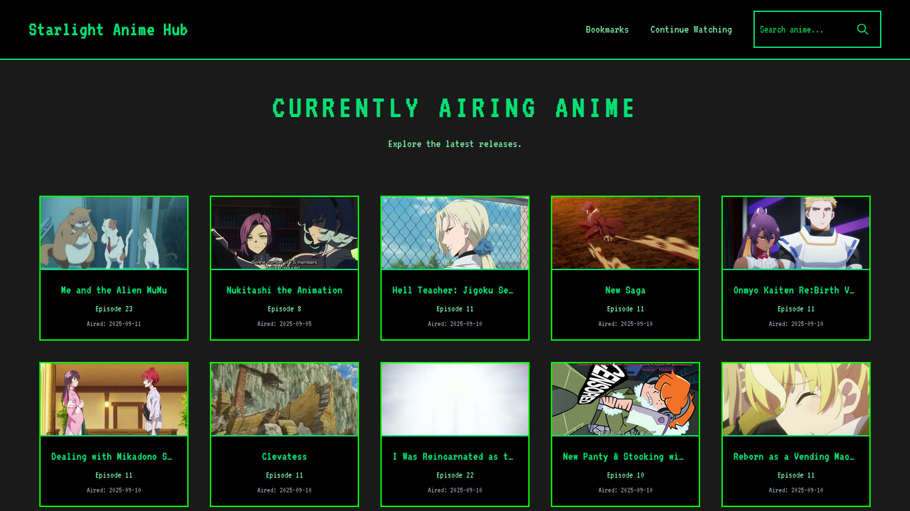
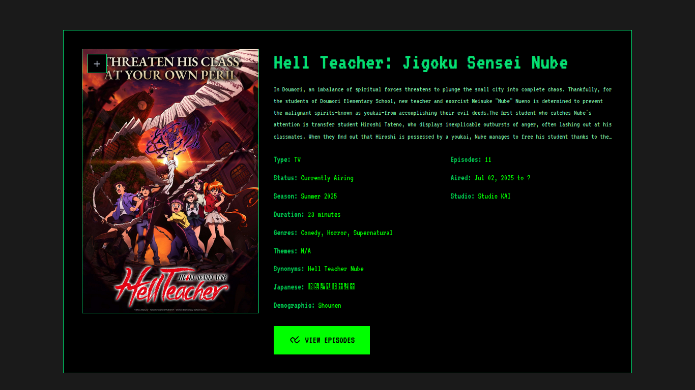
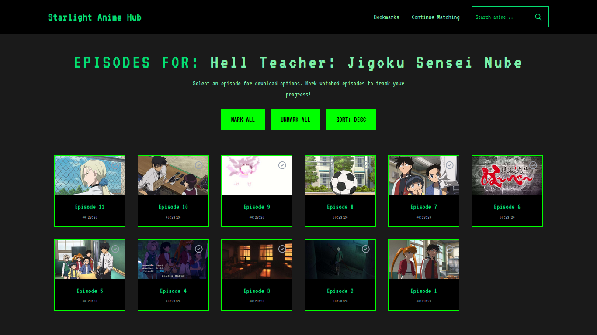
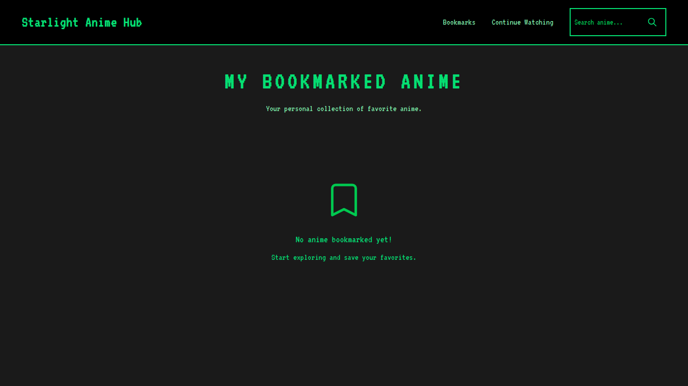

# ✨ Starlight Anime Hub ✨

## 🚀 Introduction

Starlight Anime Hub is a sleek and intuitive web application designed for anime enthusiasts to effortlessly discover, explore, and access their favorite anime. Leveraging the AnimePahe API and intelligent web scraping, it provides a seamless experience for searching anime, viewing detailed information, browsing currently airing titles, and even finding direct download links for episodes.

Built with Flask for a robust backend and a dynamic frontend powered by Tailwind CSS and vanilla JavaScript, Starlight Anime Hub offers a responsive and visually appealing interface across all devices.

## 🌟 Features

- **Anime Search:** Quickly find any anime by title with a powerful search functionality.
- **Detailed Anime Pages:** Dive deep into anime details including synopsis, genre, type, status, related anime, and recommendations.
- **Currently Airing Anime:** Stay up-to-date with the latest episodes of ongoing series, complete with pagination for easy browsing.
- **Episode Listings & Downloads:** Browse episodes for any anime and retrieve direct download links for convenient offline viewing.
- **Client-Side Bookmarking:** Save your favorite anime directly in your browser's local storage for quick access.
- **Responsive Design:** Enjoy a consistent and optimized experience on desktops, tablets, and mobile devices, thanks to Tailwind CSS.
- **Dynamic Modals:** Interactive modals for episode options and download links enhance user experience.
- **Image Proxying:** Securely loads external images through the backend to bypass CORS restrictions.
- **Clean & Modern UI:** A dark-themed interface with smooth animations and intuitive navigation.

## 🛠️ Technologies Used

### Backend

- **Python 3.x**
- **Flask:** Web framework for building the application's routes and logic.
- **Flask-Caching:** Adds caching support to Flask applications.
- **Requests:** For making HTTP requests to external APIs and web scraping.
- **BeautifulSoup4 & LXML:** Powerful libraries for parsing HTML content and extracting data.
- **Gunicorn:** WSGI HTTP Server for deploying the Flask application.

### Frontend

- **HTML5:** Structure of the web pages.
- **Tailwind CSS:** A utility-first CSS framework for rapid UI development and responsive design.
- **Vanilla JavaScript:** For interactive elements, API calls, and client-side logic (e.g., bookmarking, modals).

## ⚙️ Getting Started

Follow these instructions to get a copy of the project up and running on your local machine for development and testing purposes.

### Prerequisites

Before you begin, ensure you have the following installed:

- **Python 3.8+**
- **pip** (Python package installer)
- **Node.js & npm** (Node Package Manager) - Required for Tailwind CSS build process.

### Installation

1.  **Clone the repository:**

    ```bash
    git clone https://github.com/awtawsif/starlight-anime-hub.git
    cd starlight-anime-hub
    ```

2.  **Set up Python Backend:**

    a. Create a virtual environment (recommended):

    ```bash
    python3 -m venv .venv
    ```

    b. Activate the virtual environment:

    - On macOS/Linux:
      ```bash
      source .venv/bin/activate
      ```
    - On Windows:
      ```bash
      .venv\Scripts\activate
      ```

    c. Install Python dependencies:

    ```bash
    pip install -r requirements.txt
    ```

3.  **Set up Frontend (Tailwind CSS):**

    a. Install Node.js dependencies:

    ```bash
    npm install
    ```

    b. Build the production CSS (this will generate `starlight/static/css/tailwind.css`):

    ```bash
    npm run build:css
    ```

    - For development, you can use `npm run watch:css` to automatically recompile CSS on changes.

### Running the Application

1.  **Ensure your Python virtual environment is activated.**
2.  **Start the Flask application:**

    ```bash
    gunicorn run:app
    ```

    (For local development, you can also run `python run.py` but `gunicorn` is recommended for production-like testing.)

3.  **Access the application:**
    Open your web browser and navigate to `http://127.0.0.1:8000` (or the address Gunicorn specifies).

## 🌐 Live Demo

Experience Starlight Anime Hub live at: [https://starlight-anime-hub.vercel.app/](https://starlight-anime-hub.vercel.app/)

## 💡 Usage

- **Search:** Use the search bar in the navigation to find anime by title.
- **Browse Airing Anime:** The homepage displays currently airing anime. Use the pagination at the bottom to navigate through pages.
- **View Details:** Click on any anime card to view its detailed page, including synopsis, cast, and related titles.
- **Episode Selection & Download:** From an anime's detail page or the airing anime cards, click on an episode to see options to view details or download.
- **Bookmarks:** Click the star icon on anime cards to bookmark them. Access your bookmarks from the navigation bar.

## 🚀 Deployment

This project is configured for easy deployment on various platforms.

### Heroku

The `Procfile` specifies how to run the application on Heroku:

```
web: gunicorn run:app
```

Ensure your Heroku application is configured with a Python buildpack and the necessary environment variables.

### Vercel

The `vercel.json` file provides configuration for deployment on Vercel:

```json
{
  "version": 2,
  "builds": [
    {
      "src": "run.py",
      "use": "@vercel/python",
      "config": {
        "maxLambdaSize": "15mb",
        "runtime": "python3.9"
      }
    }
  ],
  "routes": [
    {
      "src": "/(.*)",
      "dest": "/run.py"
    }
  ]
}
```

This configuration tells Vercel to use the `@vercel/python` builder for `run.py` with Python 3.9.

## 📸 Screenshots

### Home Page



### Anime Details Page



### Episode Selection



### Bookmarks Page



## 📂 Project Structure

```
starlight-anime-hub/
├── .gitignore            # Specifies intentionally untracked files to ignore.
├── .python-version       # Defines the Python version for tools like pyenv.
├── package-lock.json     # Records the exact versions of Node.js dependencies.
├── package.json          # Node.js project metadata and scripts (e.g., Tailwind CSS build).
├── Procfile              # Configuration for Heroku deployment.
├── README.md             # Project overview and documentation.
├── requirements.txt      # Python dependencies for the backend.
├── robots.txt            # Directives for web crawlers.
├── run.py                # Main entry point for the Flask application.
├── runtime.txt           # Specifies Python runtime for deployment platforms.
├── tailwind.config.js    # Tailwind CSS configuration, including content purging paths.
├── vercel.json           # Configuration for Vercel deployment.
├── __pycache__/          # Python compiled bytecode cache.
├── .git/                 # Git version control metadata.
├── .venv/                # Python virtual environment.
├── node_modules/         # Node.js dependencies.
└── starlight/            # Core application source code.
    ├── __init__.py       # Initializes the 'starlight' package and Flask app.
    ├── api_handlers.py   # Handles all external API interactions and web scraping logic.
    ├── config.py         # Configuration settings for API URLs and headers.
    ├── extensions.py     # Initializes Flask extensions (e.g., caching).
    ├── routes.py         # Defines all Flask routes and their corresponding logic.
    ├── __pycache__/      # Python compiled bytecode cache for 'starlight' package.
    ├── static/           # Static assets (CSS, JS, images).
    │   ├── manifest.json # Web app manifest for PWA features.
    │   ├── css/          # Stylesheets.
    │   │   ├── style.css     # Custom CSS and Tailwind imports.
    │   │   └── tailwind.css  # Compiled Tailwind CSS (generated by npm run build:css).
    │   ├── img/          # Images (favicon, icons).
    │   └── js/           # Frontend JavaScript files.
    │       ├── main.js         # Main frontend logic, including modal orchestration.
    │       └── service-worker.js # Service worker for PWA features.
    └── templates/        # Jinja2 HTML templates for rendering web pages.
        ├── _modals.html          # Reusable modal structures.
        ├── anime_details_page.html # Template for displaying detailed anime information.
        ├── base.html             # Base template for consistent page structure.
        ├── bookmarks.html        # Template for displaying bookmarked anime.
        ├── continue_watching.html# Template for displaying continue watching list.
        ├── episode_selection.html# Template for episode selection and download options.
        ├── index.html            # Homepage template.
        ├── navbar.html           # Navigation bar template.
        └── search_results.html   # Template for displaying anime search results.
```
